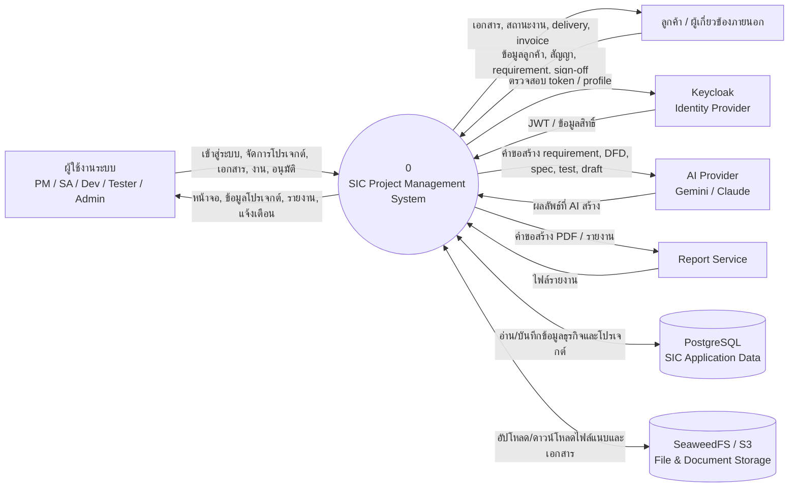
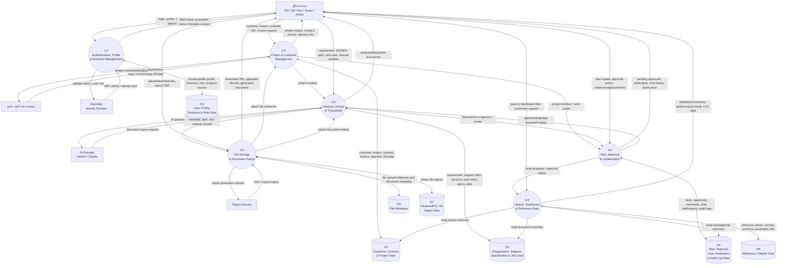

# DFD Diagrams - SIC Project

เอกสารนี้สรุป Data Flow Diagram ของระบบ SIC จากโครงสร้างโปรเจกต์ปัจจุบัน โดยอ้างอิงจาก Angular frontend, Spring Boot API, Keycloak, PostgreSQL, SeaweedFS และ Report Service ใน `docker-compose.yml` รวมถึง controller/module หลักใน backend

## DFD Level 0: Context Diagram

## DFD Level 1: Main Process Decomposition

## Process Summary

| Process | รายละเอียดหลัก | Controller / Module ที่เกี่ยวข้อง |
|---|---|---|
| 1.0 Authentication, Profile & Business Management | เข้าสู่ระบบ ตรวจสอบสิทธิ์ จัดการ profile, business, role, program access | `AuthController`, `ProfileController`, `BusinessController`, `SuUser*`, `SuBusiness*`, `SuProgramController` |
| 2.0 Project & Customer Management | จัดการลูกค้า โปรเจกต์ สัญญา delivery invoice payment และ MA | `PmCustomer*`, `PmCustomerProjectController`, `PmCustomerContractController`, `PmDeliveryController`, `PmInvoiceController`, `PmPaymentController`, `PmMa*` |
| 3.0 Analysis, Design & Traceability | จัดการ requirement, DFD/ER diagram, specification, test case, user manual และ trace link | `PmRequirementController`, `PmDiagramTabController`, `PmSpecificationController`, `PmTest*`, `PmUserManualController`, `TraceLinkController` |
| 4.0 Task, Approval & Collaboration | จัดการ phase, milestone, work package, task, approval, chat, notification, audit log | `PhaseController`, `MilestoneController`, `WorkPackageController`, `TaskController`, `PmApproval*`, `ChatController`, `NotificationController`, `AuditLogController` |
| 5.0 File Storage & Document Output | อัปโหลด/ดาวน์โหลดไฟล์ สร้างรายงาน PDF เก็บ metadata และ object file | `StorageController`, report-service, SeaweedFS |
| 6.0 Search, Dashboard & Reference Data | ค้นหาข้อมูล dashboard, combobox, reference/master data | `GlobalSearchController`, `PmProjectDashboardController`, `ComboboxController`, `DbParameterController` |

## Data Stores

| Data Store | ข้อมูลที่จัดเก็บ |
|---|---|
| D1 User, Profile, Business & Role Data | ผู้ใช้ profile business role permission program access |
| D2 Customer, Contract & Project Data | ลูกค้า โปรเจกต์ สัญญา delivery invoice payment MA |
| D3 Requirement, Diagram, Specification & Test Data | requirement, DFD/ER diagram, diagram version, specification, test scenario, test case, manual, trace link |
| D4 Task, Approval, Chat, Notification & Audit Log Data | phase, milestone, work package, task, approval flow/log, chat, message, notification, audit log |
| D5 File Metadata | upload reference, file id, bucket/object key, visibility/category |
| D6 Reference / Master Data | country, province, district, sub-district, title, parameter, mail template/config |
| D7 SeaweedFS / S3 Object Files | ไฟล์จริง เช่น image, video, document, generated report |
